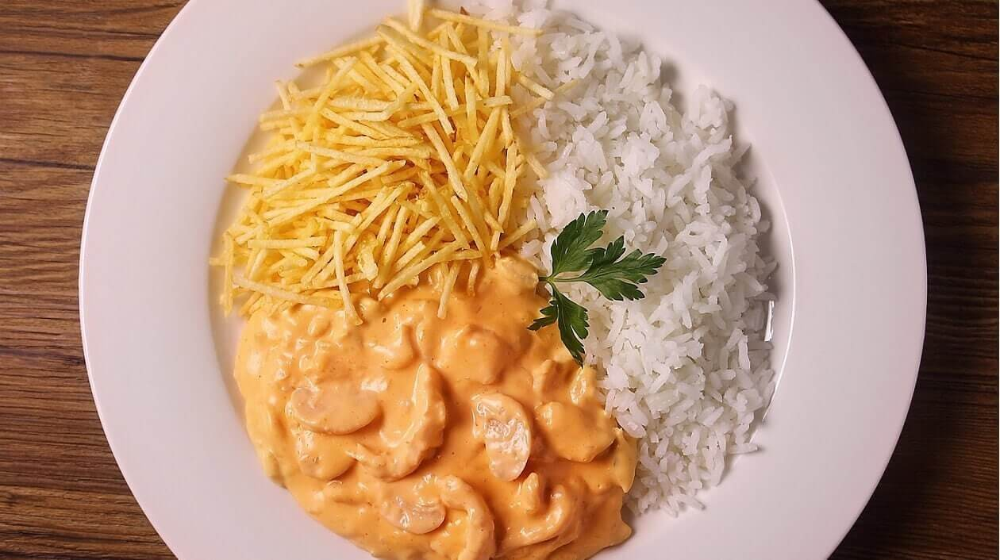
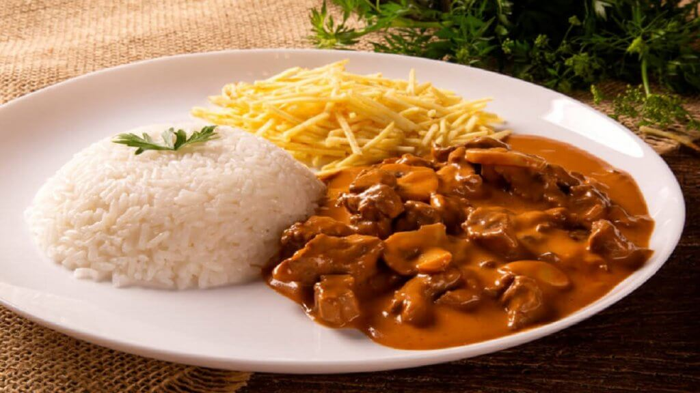
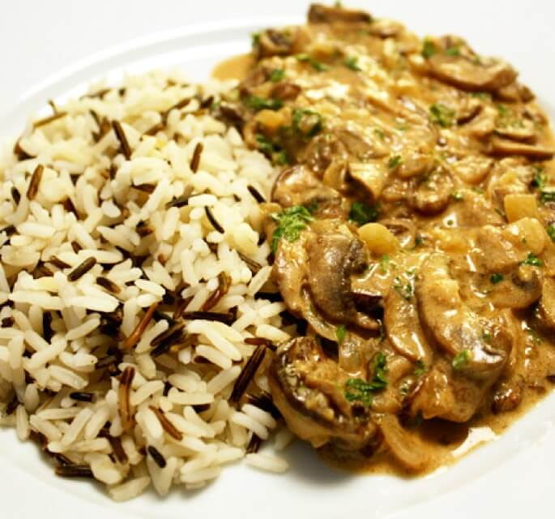

# Livro de receitas

Olá! Bem vindo ao meu livro de receitas

- Strognoff de frango

- Strognoff de carne

- Strognoff vegano

- Pavê doce de sobremesa
  :pray:

  ## Strogonoff frango

  

## Ingredientes

* 1 kg de peito de frango
* 2 colheres de sopa de manteiga
* 1 cebola grande picada
* 200 g de champignon laminado ou inteiro
* 5 colheres sopa de molho inglês

# Strogonoff carne

## Ingredientes

* 1 kg de filé-mignon ou (alcatra,patinho,coxão mole) em tiras (tempere com sal e pimenta)
* 2 colheres (sopa) de manteiga
* 1 cebola grande picada
* 5 colheres (sopa) de molho inglês

## Ingredientes

* 1 cebola picada
* 1 dente de alho
* 250 g de cogumelos de paris(champignon fatiados)
* 150 g de shitake fatiados sem os talos
* 25 g de manteiga sem sal

